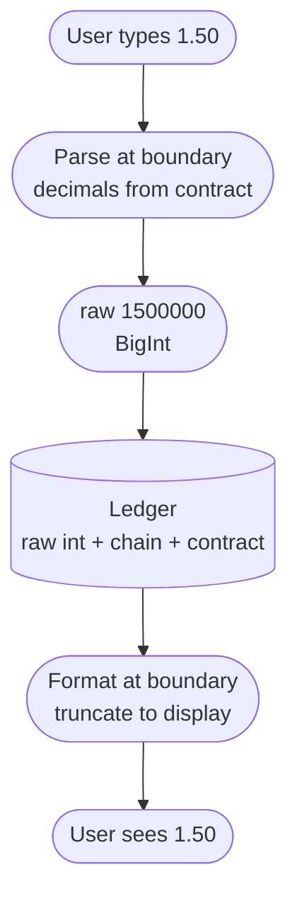

A user deposits 500 USDT on TRON. The transaction confirms, the explorer shows the tokens sitting in our deposit wallet, and our platform credits the account 0.0000000005 USDT. The money arrived. The balance updated. The amount was off by a factor of a trillion.

I was working on the crypto payment platform I've written about before, deposits and withdrawals across Ethereum, TRON, and Solana, and this was the bug that forced the decimal conversation we'd been putting off. The cause was one line. A `raw / 10 ** 18` in the crediting path, written by someone who learned tokens on Ethereum, where 18 decimals is the water you swim in. USDT on TRON has 6. Every deposit on that rail was being shrunk by a factor of 10^12.

The fix was one line too, but we didn't stop there. We made a decision. Human-readable amounts are banned from the interior of the system. Everything inside moves as a raw integer, tagged with its chain and contract, and the decimal point is allowed to exist in exactly two places, where user input enters and where a balance leaves to be displayed.

Making that rule stick meant understanding where the decimal point actually comes from, because it isn't where most people think.

---

## The chain has never seen a decimal point

Solidity has no floating-point type. There is no way to put "1.5" on the EVM. Every token balance is a `uint256`, a plain integer, and `balanceOf` returns that integer. When a wallet shows you 1.50 USDT, it has read the contract's `decimals()` function, divided, and rendered the result.

```
what the chain stores:        1500000
decimals (contract metadata): 6
what the wallet shows:        1500000 / 10^6  =  1.5 USDT
```

The "1.5" never exists on-chain. It is re-derived every time anyone looks. Two contracts can return the exact same `balanceOf` for two accounts and mean amounts a trillion times apart, and the chain has no opinion about it. EIP-20, the standard every ERC-20 implements, lists `decimals()` as OPTIONAL, right there in [the spec](https://eips.ethereum.org/EIPS/eip-20). Interfaces are told not to expect it to exist.

So the decimals field doesn't describe the amount. It records the deployer's preference about where you might like to draw a dot.

Where do 6 and 18 come from? ETH's own unit divides into 10^18 wei, and OpenZeppelin's ERC-20 implementation defaults to 18, so most Ethereum tokens inherit 18 without anyone deciding anything. Tether chose 6 for USDT, a fiat-flavored number, dollars and cents with headroom. Circle matched it for USDC. TRON's TRC-20 standard copies ERC-20's semantics, so USDT on TRON is 6, and TRX itself divides into 10^6 sun. Solana's SOL divides into 10^9 lamports, named for Leslie Lamport. None of these are constants of nature. They're choices made by whoever deployed the contract, which is exactly the problem.

---

## Six and eighteen are choices, not constants

Because decimals live in the deployment, they follow the contract, not the ticker. Here's what that looks like once you support more than one chain:

| Asset | Chain | Decimals | One token, in raw units |
|---|---|---|---|
| USDT | Ethereum | 6 | 1,000,000 |
| USDT | TRON | 6 | 1,000,000 |
| USDT | BSC | 18 | 1,000,000,000,000,000,000 |
| USDC | Ethereum | 6 | 1,000,000 |
| USDC | Solana | 6 | 1,000,000 |
| ETH | Ethereum | 18 | 1,000,000,000,000,000,000 |
| SOL | Solana | 9 | 1,000,000,000 |
| TRX | TRON | 6 | 1,000,000 |

Same ticker, third row. [USDT on BSC](https://bscscan.com/token/0x55d398326f99059fF775485246999027B3197955) is 18 decimals, because it's a Binance-pegged re-issuance, not the same contract. A config file that says "USDT = 6" is correct until the day you add a chain where it isn't, and it will not fail loudly. It will fail by moving the dot twelve places.

Bridged assets make this routine. Bridges regularly re-issue tokens with a different decimals value than the canonical mint (Wormhole's wrapped tokens, for instance, are 8 decimals). And on Solana the decimals are a `u8` frozen into the mint at creation, while the symbol is just metadata that anyone can set. Anyone can mint a token called USDC with 18 decimals, or with 0. The mint address is the identity. Everything else is costume.

We stopped treating decimals as a property of a currency and started treating it as a property of a specific deployment on a specific chain, keyed by (chain, contract). The ticker is for humans. The system never trusts it.

---

## Your runtime wants to lose the zeros too

Say you get every decimals value right. There's still the matter of representing the numbers. JavaScript has one numeric type, the IEEE 754 double, and it keeps 53 bits of integer precision:

```
Number.MAX_SAFE_INTEGER =     9,007,199,254,740,991   (~9 x 10^15)
one 18-decimal token    = 1,000,000,000,000,000,000 raw   (10^18)
```

A single whole token of an 18-decimal asset, in raw units, sits about 111 times past the point where a JS number starts silently rounding to neighbors. And that's before the classic `0.1 + 0.2 = 0.30000000000000004`, which shows up the moment someone parses user input with `parseFloat` and multiplies.

If an amount passes through a JavaScript number, it stops being the amount. Raw values travel as `BigInt`, and parsing "1.50" into 1500000 is decimal-string arithmetic, not float math. Every serious EVM library returns balances as bignum for exactly this reason.

---

## Why not just standardize on 18 internally?

The respectable alternative is to pick one internal precision, usually 18, and normalize every asset into it at the boundary. Plenty of systems do this, including much of DeFi. It makes cross-asset math uniform, 18 covers everything we listed, and you only think about decimals on the way in and out. That was genuinely on the table for us.

We went the other way because every normalization is a conversion, and every conversion is a place to lose a zero. Converting up is multiplication, and multiplication is safe. But once amounts live at 18 decimals, your own arithmetic starts producing precision the chain can't represent. A 2.5% fee on a 6-decimal asset computed in 18-space has a remainder when you convert back, and now your ledger needs a rounding policy for dust that doesn't exist on-chain. Rounding policy inside a ledger is where quiet discrepancies breed. Keeping each amount in its native raw form means the number in the database is the number on the chain, and you can audit a balance against an explorer with your eyes, no arithmetic.

The principle that fell out of all this: the decimal point belongs at the edges of the system, and nothing in the middle should ever see one.

Worth naming the asymmetry too. Misread an amount on the way in and you've mis-credited. That's a migration and an apology. Miscompute an amount on the way out and you've signed a transaction that the chain executes exactly as specified. There is no support ticket that un-confirms a transfer. So the write path gets paranoia the read path never needs, explicit BigInt types, decimals assertions, round-trip tests, because that's the direction where a zero actually leaves the building.

---

## What this looked like in practice



*The dot exists at exactly two moments in an amount's life. Everything in between is integers.*

**Fetch decimals from the asset, never from a ticker table.** Call `decimals()` on the contract or read the mint, then cache by (chain, contract). Ticker-keyed constants are how "USDT is 6 everywhere" survives three chains and detonates on the fourth.

**Parse input to raw at the request boundary.** The string a user typed becomes a raw BigInt in the controller, using decimal-string math. The human form never travels deeper than that. Anything downstream that sees a dot is a bug reporting for duty.

**Do all arithmetic in BigInt.** Sums, differences, comparisons. The moment someone writes `Number(amount)` to make a log line pretty, the amount stops being the amount. We typed ledger entries so the compiler refused anything else.

**Format for display by truncation, never rounding.** A rounded-up balance shows the user money they don't have. Truncate to the asset's display precision and let the dust be. "Missing 0.000001" tickets are cheaper than "my balance says 5.00 but I can only withdraw 4.999999" tickets.

**Assert decimals in the integration test and at startup.** When adding an asset, fetch decimals from the deployed contract and compare it against config. Contracts get upgraded, bridged variants differ, and config files get copy-pasted. A startup check that refuses to boot on mismatch turns a silent trillion-fold error into a deploy that doesn't happen.

**Test with ugly numbers.** One raw unit. 999,999 raw, a hair under one. Amounts straddling 2^53. And round-trip everything. Parse, store, format, and the output string must equal the input string.

---

## Quick reference

**Decimals as actually deployed:**
- USDT: 6 on Ethereum and TRON, 18 on BSC. Same ticker, different raw meaning.
- USDC: 6 on Ethereum and Solana. Bridged variants can differ (Wormhole uses 8).
- Natives: ETH 18 (wei), SOL 9 (lamports), TRX 6 (sun).

**Numbers worth memorizing:**
- 2^53 − 1 = 9,007,199,254,740,991. Past this, a JS number silently rounds.
- One whole 18-decimal token is 10^18 raw, ~111x past that line.
- Confusing 6 and 18 is a factor of 10^12. There is no small version of that mistake.

**Rules that served us well:**
- Raw integers in the ledger, keyed by (chain, contract), never by symbol.
- Decimals fetched from the asset, cached, asserted in tests and at startup.
- Parse at the input boundary, format at the display boundary, BigInt everywhere between.
- Truncate when rendering. Never round up a balance.

---

Every money system reinvents this split eventually. Banks count cents, exchanges count basis points, Bitcoin counts satoshis. Blockchains add two twists that make the old discipline matter more. The conversion factor is per-contract metadata that anyone can set, including people trying to confuse you. And the write path is irreversible, so a conversion error isn't a wrong invoice, it's a signed transaction executed exactly as specified. Keep machine units inside the system and human units at the glass, and treat every conversion as a place where money quietly changes hands.

> The chain has never seen a decimal point. It stores integers, plus a suggestion about where you'd like to pretend one goes. Keep the pretending at the edges.
