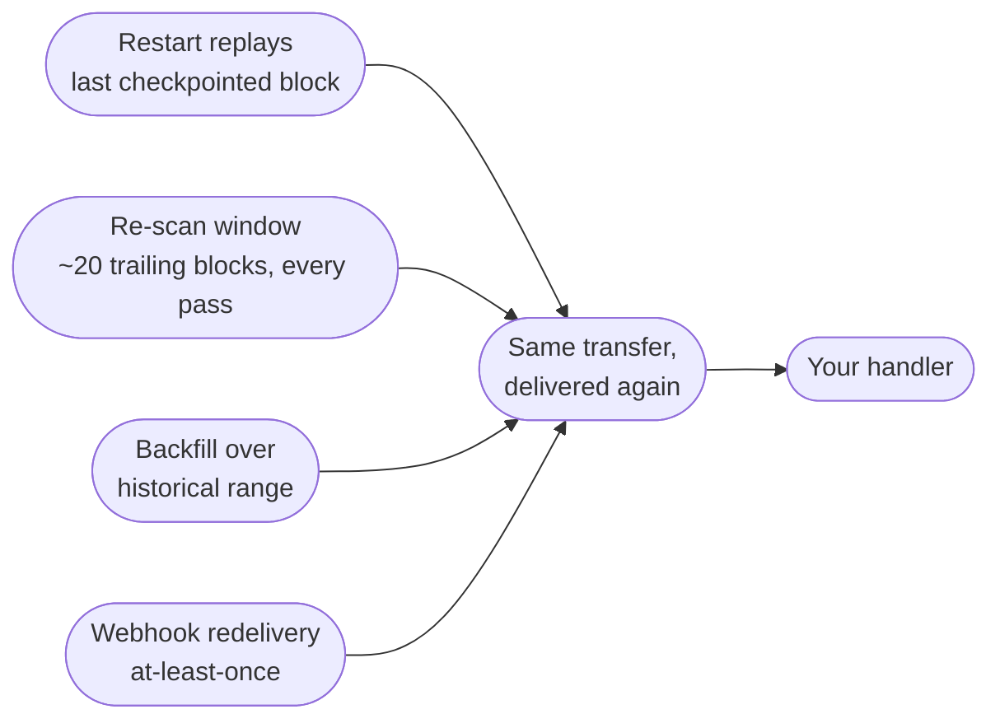
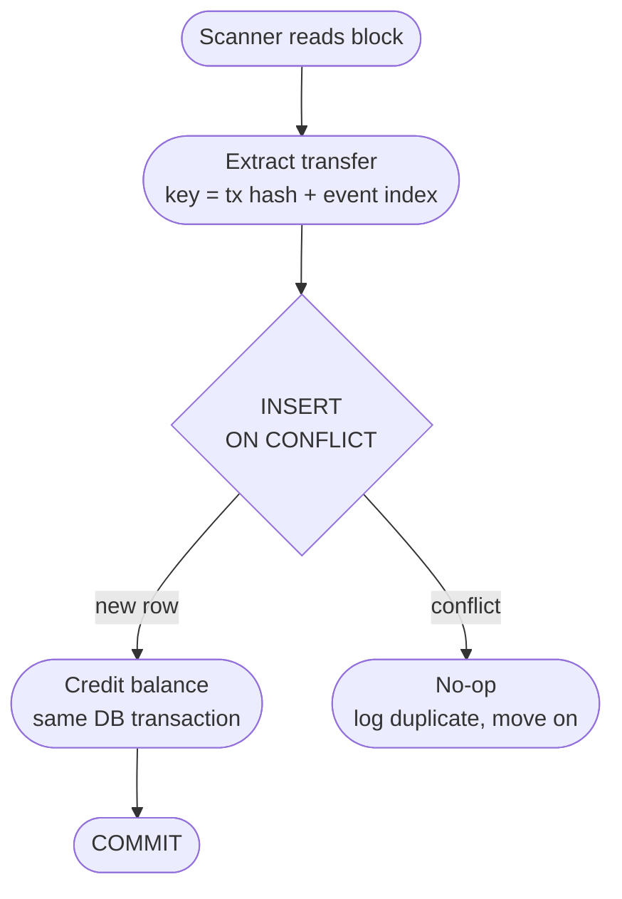

You deploy a small fix to your deposit scanner on a Friday evening. The process restarts, picks up from its last checkpoint, and re-reads a block it had already processed. Somewhere in that block is a 200 USDT deposit from three hours ago. On Monday the user opens a ticket, politely, to say their balance looks... generous. They got credited twice for one transfer, and the transaction hash in both credit rows is identical. This scenario is invented, whether it resembles a particular Friday of mine is between me and the audit log. And yes, in reality nobody opens a ticket about a free 200 USDT. They withdraw it and forget it ever happened, which is how you find out from your books instead of your users.

Nothing exotic happened. No reorg, no attacker, no provider outage. The scanner just did what scanners do, which is see the same transaction more than once. The bug was that seeing it twice caused it to *act* twice.

I hit this while building our crypto payment handler that watched deposit addresses on TRON and Solana. The decision on the table was how to guarantee that one on-chain transfer produces exactly one balance credit, no matter how many times the pipeline delivers it. What I landed on was *naturally* an **idempotency** key, `(tx hash, event index)`, enforced as a unique constraint in Postgres, with the credit applied in the same database transaction as the insert. This post is the reasoning.

---

## Your pipeline will deliver duplicates, on purpose

The instinct is to treat a duplicate delivery as a bug to be eliminated upstream. It isn't. Every mechanism that makes a deposit scanner reliable also makes it deliver duplicates.

**Restarts.** A scanner keeps a checkpoint, the last block height it processed. You can advance the checkpoint before processing a block or after. Advance it before and a crash mid-block loses deposits. Advance it after and a crash mid-block replays the whole block on restart. Losing money is worse than replaying, so every sane scanner checkpoints after, which means every restart potentially replays the last block it touched.

**Re-scan overlap.** Chains reorganize. On TRON, a block isn't solid until 19 of the 27 super representatives have built on it, roughly 57 seconds at 3-seconds a block. A scanner that only ever reads each height once will miss transactions that moved between blocks during a reorg. The standard fix is to re-scan a trailing window on every pass, the last 20 blocks or so, which means a typical deposit gets read not twice but around twenty times before it leaves the window.

**Backfills.** At some point you will find a gap, a week where a filter was wrong or a provider dropped events, and you will want to re-run the scanner over 200,000 historical blocks. If duplicate delivery corrupts balances, that backfill is a live grenade, and you'll postpone it. If duplicates are harmless, you run it on a Tuesday afternoon.

**Webhook replays.** If you use a provider's webhook stream instead of polling, read their delivery guarantee. It is always at-least-once. Every serious provider says outright that you may receive the same event multiple times and that your handler must be idempotent. They can't promise exactly-once across their own retries and your timeouts, and neither can you.


*Four independent mechanisms, one shared output. None of them is a bug, and all of them hand your handler a transfer it has already seen.*

So the question is never "how do I stop duplicates from arriving". They will arrive. The question is what makes the second arrival a no-op.

---

## The tx hash alone is not the key

The obvious key is the transaction hash. Unique per transaction, printed on every explorer, already in your data. It's also wrong, for a reason that bites the moment a real payment flow shows up.

One transaction is not one transfer. A **TRC-20** transaction can emit several `Transfer` events, and on Ethereum-style chains a single transaction routinely fans out through internal calls, a batch payout contract paying 50 recipients in one tx. On Solana, one transaction carries multiple instructions, and an exchange sweeping hot wallets will happily pack several SPL token transfers into a single signature. If two of those transfers land on addresses you watch and your key is the tx hash, the second one silently dedupes against the first. That is a *lost deposit*, the exact failure the whole system exists to prevent, produced by your own safety mechanism.

The unit you're crediting is not the transaction, it's the transfer, so the key has to identify the transfer itself. Every chain gives you a stable index for this:

```
EVM / TRON     (tx hash, log index)
Solana         (signature, instruction index [, inner instruction index])
Bitcoin-like   (txid, vout)
```

Both parts come from the chain itself, which matters more than it looks. The hash is unique because forging a collision means breaking SHA-256, and the index is stable because it's part of the block's committed contents. Any two honest nodes, any two scans, any restart will report the same pair for the same transfer.

Just as important is what stays *out* of the key. Not the block hash and not the block height, because a reorg can move a transaction to a different block while the transaction itself, hash and contents, is unchanged. If block height were part of the key, the re-scanned post-reorg copy would look like a new deposit and you'd credit it twice, this time with a genuinely confusing audit trail. Not the timestamp, not the scan ID, not anything your pipeline generated. The key must be derived entirely from what the chain committed to, because the chain is the only party in the system that never restarts.

---

## Enforce it where the race can't reach

Knowing the key is half the decision. The other half is where to check it, and the tempting answers are all in application code.

The in-memory version keeps a set of seen keys and skips anything already present. It dies with the process, which is exactly when you need it most, since a restart is the number one source of duplicates. The check-then-insert version queries the database first ("have I seen this key?") and inserts if not. That survives restarts but has a classic time-of-check to time-of-use race. Run two scanner workers, or one worker plus a webhook handler, and both can pass the check before either inserts. The window is milliseconds wide, and at a few thousand deposits a day you will hit it within weeks. Not "probably won't". **Will**.

The database already solves this. A unique constraint on the key is enforced atomically by the storage engine, no race, no coordination between workers, no dependence on process lifetime.

```sql
CREATE TABLE deposits (
  tx_hash     text    NOT NULL,
  event_index integer NOT NULL,
  address     text    NOT NULL,
  amount      numeric NOT NULL,
  credited_at timestamptz DEFAULT now(),
  UNIQUE (tx_hash, event_index)
);

INSERT INTO deposits (tx_hash, event_index, address, amount)
VALUES ($1, $2, $3, $4)
ON CONFLICT (tx_hash, event_index) DO NOTHING;
```

The last piece is the one that actually protects the balance. The insert and the credit have to be one atomic unit:

```sql
BEGIN;
  INSERT ... ON CONFLICT DO NOTHING;      -- returns 0 rows if duplicate
  -- only if the insert took effect:
  UPDATE balances SET amount = amount + $4 WHERE address = $3;
COMMIT;
```

If the insert reports a conflict, skip the credit. If the process dies between the two statements, the transaction rolls back and the next delivery of the same event does the whole thing cleanly. Split them across two transactions and you've rebuilt the original bug with extra steps, an insert that succeeds and a credit that runs twice.


*Everything left of the INSERT can run any number of times. Only the first arrival gets past it.*

---

## Why not exactly-once delivery instead?

The alternative worth taking seriously is fixing the delivery side, making the pipeline itself exactly-once. Commit the checkpoint in the same database transaction as the effects, so a block is either fully processed and checkpointed or neither. This is a real technique, it's how serious stream processors get their transactional guarantees, and inside one closed loop it genuinely works. If my scanner were the only writer and polling were the only source, checkpoint-with-effects would have been defensible.

But the exactly-once guarantee only holds inside the loop that owns the checkpoint. The trailing re-scan window redelivers by design, and no checkpoint arithmetic changes that. A backfill deliberately reprocesses old blocks, checkpoint be damned. A webhook handler doesn't share the poller's checkpoint at all. Every one of these re-enters the system from outside the loop, and each one would need its own bespoke dedup logic, which is to say the idempotency key again, reinvented per entry point and probably inconsistently.

The idempotency key covers all of them with one mechanism, because it doesn't care how an event arrived, only whether its key has been seen. That asymmetry decided it. Exactly-once delivery protects one path into the system, idempotent application protects every path, including the ones you haven't built yet.

The principle I took away is this. Make delivery at-least-once and make application exactly-once, and put the exactly-once where the money changes.

The everyday case, to be clear, is boring. A scanner that never restarted and never re-scanned would never produce a duplicate, and yours will run for weeks without one. The threat model isn't the steady state. It's the deploy, the crash, the backfill, the day you switch providers, the tail of operational events that all happen to share "same transaction, delivered again" as their failure mode.

---

## What this looked like in practice

**Key on the transfer, not the transaction.** `(tx hash, event index)` on TRON and EVM chains, `(signature, instruction index)` on Solana. The one-tx-many-transfers case is not hypothetical, batch payouts and exchange sweeps produce it daily, and a tx-hash-only key turns each one into a lost deposit.

**Put the constraint in the database and nowhere else.** Application-level checks can stay as fast-path optimizations, but the unique constraint is the actual guarantee. It's the only check that holds across restarts, across concurrent workers, and across entry points that don't know about each other.

**Credit in the same transaction as the insert.** The insert is the lock and the ledger entry at once. If the conflict fires, the credit is skipped inside the same atomic unit. Two transactions here is the same bug wearing a nicer schema.

**Keep pipeline-generated data out of the key.** No block height, no block hash, no timestamps, no scan run ID. The key is derived from chain-committed data only, because a reorg or a re-scan changes everything about the delivery except the transfer itself.

**Log duplicates instead of dropping them silently.** A counter of `ON CONFLICT` hits is free and tells you things. A slow steady rate matching your re-scan window is health. A spike is a stuck checkpoint, a replaying webhook, or a provider incident, visible hours before anyone files a ticket.

**Re-scan casually, because now you can.** Once duplicate delivery is a guaranteed no-op, a full backfill is an ordinary maintenance task instead of a risk assessment. We re-ran weeks of history more than once, and the deposits table came out identical each time. The mechanics ended up pleasantly boring, which is the goal.

---

## Quick reference

**The key, per chain:**
- EVM / TRON, `(tx hash, log index)`
- Solana, `(signature, instruction index)`, add the inner instruction index if you parse CPIs
- Bitcoin-like, `(txid, vout)`

**Rules:**
1. Key identifies the transfer, not the transaction
2. Only chain-committed data in the key, never block height/hash or timestamps
3. Unique constraint in the database, `INSERT ... ON CONFLICT DO NOTHING`
4. Balance credit in the same DB transaction as the insert
5. Count conflict hits and alert on spikes

**Where duplicates come from:**
- Restart replaying the last checkpointed block
- Trailing re-scan window (~20 blocks per pass is typical)
- Backfills over historical ranges
- Webhook at-least-once redelivery

---

## The pattern is older than the blockchain

Nothing here is crypto-specific. Stripe asks API clients to send an [idempotency key](https://docs.stripe.com/api/idempotent_requests) header for exactly this reason, retried charge requests must not charge twice. Message queues settled on at-least-once delivery plus idempotent consumers decades ago, because exactly-once across a network boundary keeps turning out to be a distributed-systems mirage. Crypto deposits just make the pattern unusually crisp, because the chain hands you a perfect natural key for free. You don't have to generate a UUID and thread it through the request like Stripe's clients do. The transaction hash and event index are already globally unique, already immutable, already in the data you're processing.

Anywhere money moves in response to events, the same two-part shape applies. Let events arrive as many times as the infrastructure wants, and make the state change keyed so that only the first arrival changes anything.

---

> Assume every deposit event will be delivered twice. Your job isn't to prevent the second delivery, it's to make sure the second delivery does nothing.
