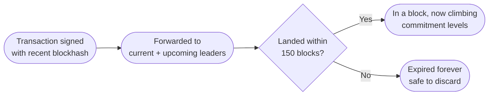
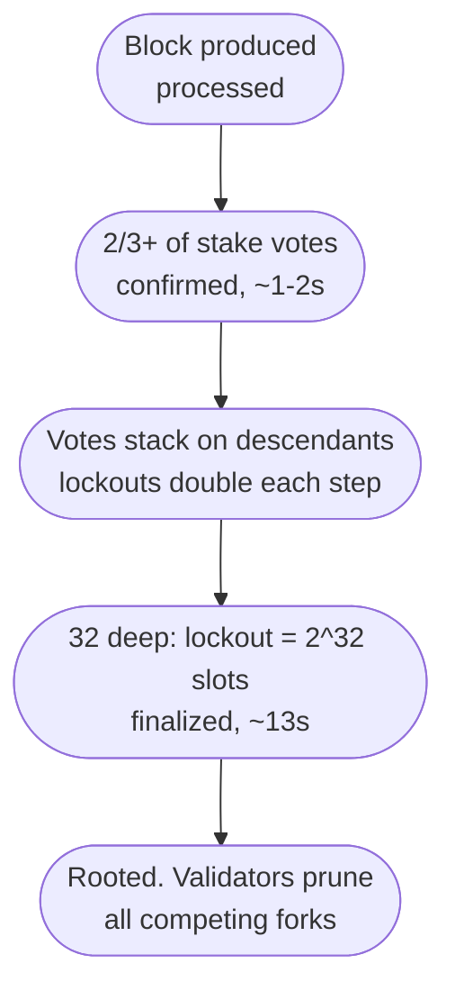

When a user sends SOL to a deposit address, their wallet reports success almost immediately, and an explorer shows the transaction a second or two later. If you're handling payments like we were, that's exactly the moment you have to resist crediting anything.

I was recently building a crypto payment handler that supported multi-chain deposits, Solana being one of them, and one of the decisions we had to sit down and make was when a deposit counts. Solana gives you three commitment levels to work with, and after weighing the options we landed on the strictest one. We chose to wait for the finalized state before touching a balance. Plenty of platforms do it differently and credit deposits earlier. We chose to trade a few seconds of delay for never having to think about a reverted deposit again.

Making that call sensibly meant understanding a few things about how Solana actually moves a transaction from signed to irreversible, because it does it quite differently from the chains most deposit pipelines were designed around.

---

## There is no pending queue to watch

If you've built deposit detection on Ethereum, you know the drill. Transactions sit in a public mempool, sometimes for minutes, sometimes for hours. They can be repriced, replaced, or dropped. You can watch a payment approach the chain before it lands, and you also inherit all the ambiguity that comes with it. Is this transaction still coming? Was it replaced? Do we wait or give up?

Solana skips the queue. There's no persistent, network-wide mempool. The leader schedule is known in advance for the whole epoch, so under a design called **Gulf Stream**, RPC nodes and validators forward transactions directly to the current leader and the next few in line. A transaction doesn't wait in a shared pool for someone to pick it up. It's aimed at the specific validator whose turn it is.

The other half of this is expiry. Every transaction embeds a recent blockhash, and that blockhash is only valid for 150 blocks, roughly a minute of chain time. If the transaction hasn't landed by then, it can never land. Not "probably won't", Can't. Any validator seeing it afterward rejects it as expired.

For deposit handling this is a genuinely nice property. On Solana a transaction is only ever in one of three states. It landed in a block, it's still inside its blockhash window, or it's dead. There's no zombie transaction that resurfaces from a mempool three hours later. Our pending-deposit logic had a hard timeout and we could trust it.



So detection is easy. 

*But* the hard question comes after that. The transaction is in a block, sure, but which blocks do you trust?

---

## Three commitment levels, three different promises

Solana RPC exposes three commitment levels, and they're not gradations of the same thing. They're different claims.

**Processed** means one leader put the transaction in a block and your RPC node has seen it. That's it. Solana skips slots all the time when a leader is offline or late, and short-lived minority forks are routine at the tip. A processed block can simply vanish. Around 5% of slots get skipped on a normal day. Wallets use processed to show you that snappy instant success, which is fine for UX and completely unacceptable for crediting anything.

**Confirmed** means a supermajority of stake, over two thirds, has voted on the block. Solana calls this optimistic confirmation. This is a real guarantee. By design, a confirmed block can't be reverted unless a large chunk of stake violates its own votes, which is detectable and slashable behavior. In practice, an optimistically confirmed block has never been rolled back on mainnet. You get to confirmed in a second or two.

**Finalized** means the block is rooted. Enough blocks have been built on top of it, with the cluster voting along the way, that validators have locked themselves in. This takes around 12 to 15 seconds. This is the one with the 32 blocks, and it's worth seeing why 32 specifically.

---

## Tower BFT and the exponential lockout

Solana's consensus, Tower BFT, has validators vote on forks with a rule that makes changing your mind exponentially expensive. Each vote on a fork carries a lockout, a number of slots during which the validator is forbidden from voting for any competing fork. Every consecutive vote that confirms the previous ones doubles the lockout of every vote beneath it in the tower.

So the first vote locks you out for 2 slots. Easy to walk back if the network switches forks; you were barely committed. But the doubling compounds fast:

```
votes on top:  1    2    4     8     16        32
lockout:       2    4    16    256   65,536    4,294,967,296 slots
```

Once 32 consecutive votes stack on top of a block, the lockout on that block hits 2^32 slots. At 400ms per slot that's north of 50 years. The validator's stake is committed to that fork for a duration that has left the realm of practical reversibility, so the block is rooted, and rooted blocks are what `finalized` reports.

That's the meaning behind "32 blocks deep." It's not an arbitrary confirmation count like waiting 6 blocks on Bitcoin, where each block just adds more proof of work to outpace. It's the point where the consensus mechanism's own doubling rule makes reversal a mathematical non-option rather than an economic gamble.



---

## So why not credit on confirmed?

To be clear, confirmed is very good. Optimistic confirmation is a studied, deliberate guarantee, not a heuristic, and plenty of serious platforms credit deposits at confirmed. That was the real alternative on the table when we made the call, and it's a reasonable one. A rollback of a confirmed block requires mass slashable equivocation and has never once happened.

What tipped us the other way was thinking through what a credit actually is on a payment platform.

The moment we credited a deposit, the user could act on it. Convert it, pay a merchant with it, withdraw it to another chain. Within seconds of the balance updating, we could be irreversibly committed on some other rail. Our credit was a settlement, not a display update.

That asymmetry drove the decision. Match the finality of your action to the finality of its trigger. If crediting only changed a number the user looked at, confirmed would be fine, and honestly even processed would mostly be fine. But our number was a claim on funds that could exit the system immediately, so the trigger had to be the strongest state the chain offers.

The threat model isn't really "Solana rolls back a confirmed block during normal operation." It's the tail. Consensus bugs, network partitions, an incident weird enough that "never happened before" stops being load-bearing. Solana has had outages where the cluster halted and restarted from a snapshot. Confirmed held up through those, but each one was a reminder that the tail exists. Finalized means that even in the weird scenarios, the protocol itself has no path to un-writing the block short of a coordinated restart that abandons rooted state, which is no longer a blockchain risk. It's a "the world changed" risk, and no commitment level insures against those.

And the price of that insurance was about twelve seconds. On Bitcoin the equivalent caution costs an hour. On Ethereum, finality is around 13 minutes. Twelve seconds to go from "extremely unlikely to revert" to "the consensus rules cannot revert this" is one of the cheapest risk reductions in the industry. And we took it.

This is also why the same policy doesn't transplant cleanly to the other chains we supported. Bitcoin never finalizes anything; six confirmations is a probability judgment, not a guarantee, and waiting an hour on every deposit is a real product cost, so you size the wait to the deposit amount instead. Ethereum does have true finality, but making users wait 13 minutes when the ecosystem norm is a dozen block confirmations puts you well outside what people will tolerate. On those chains, crediting is unavoidably a risk-weighted compromise. Solana is the rare case where the uncompromising option is cheap enough to just take.

---

## What this looked like in practice

The mechanics ended up pleasantly boring, which is the goal.

**Subscribe at confirmed, credit at finalized.** We watched deposit addresses at the confirmed level so the UI could show an incoming deposit early. Users saw "deposit detected, awaiting finality" within a couple of seconds, which killed most of the "where's my money" tickets. The actual balance mutation only fired once the transaction's slot was at or below the chain's current root.

**Poll the root, not the transaction.** You don't need to re-fetch the transaction repeatedly. Once you know its slot, compare against `getSlot` at finalized commitment. When the finalized slot passes the transaction's slot, confirm it's still there with one `getTransaction` at finalized, then credit. The re-check matters, because you're verifying the transaction is in the rooted fork rather than just that time has passed.

**Handle the expiry window explicitly.** A user-submitted transaction that hasn't landed after its blockhash expires is gone, and you can tell the user so with confidence. This is where Solana's lack of a mempool pays off. We never had to answer "it's been pending for six hours" for a Solana deposit, because that state doesn't exist.

**Don't trust one RPC node's view.** Commitment is reported by the node you ask. A lagging or misbehaving node can tell you something is finalized based on stale or wrong state. We cross-checked deposit credits against a second independent RPC provider. Cheap redundancy for the exact component where a lie costs real money.

---

## Quick reference

**Commitment levels for deposit flows:**
- `processed`: display only, can vanish with a skipped slot or minority fork
- `confirmed`: 2/3+ stake voted, never reverted in practice, fine for showing pending deposits
- `finalized`: rooted under Tower BFT lockout, 32 votes deep, the credit trigger

**Timing:**
- Confirmed: ~1 to 2 seconds
- Finalized: ~12 to 15 seconds
- Blockhash expiry: 150 blocks, roughly a minute; after that the transaction is permanently dead

**Rules that served us well:**
- Match credit finality to what the credit unlocks. Withdrawable balance means finalized.
- Show the deposit at confirmed, credit it at finalized. Users tolerate a countdown; they don't tolerate silence.
- Verify against the rooted fork with a final `getTransaction` at finalized, from more than one RPC source.

---

The pattern generalizes past Solana. Every chain gives you a spectrum between "a block exists" and "this cannot be undone," and the tempting mistake is picking a point on that spectrum based on how it feels rather than what your system does next. If nothing irreversible happens downstream, be fast. If money leaves the building, be final. Solana just makes the second option unusually affordable, so there's not much excuse for skipping it.
