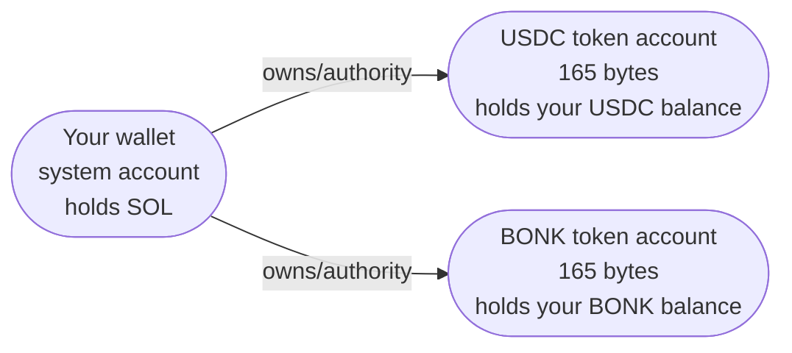
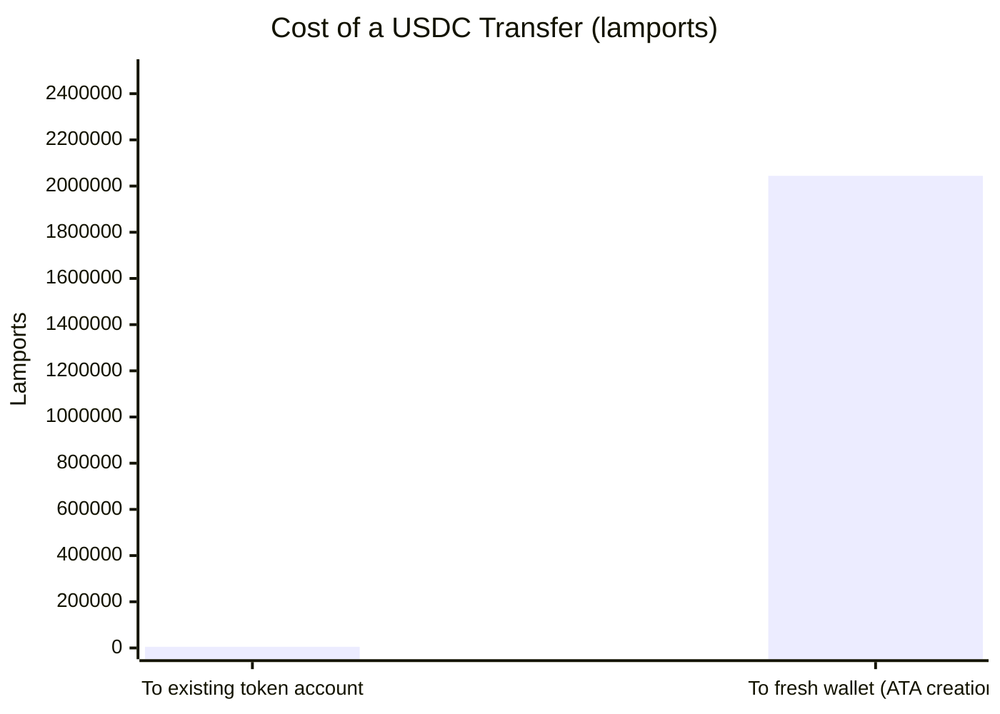
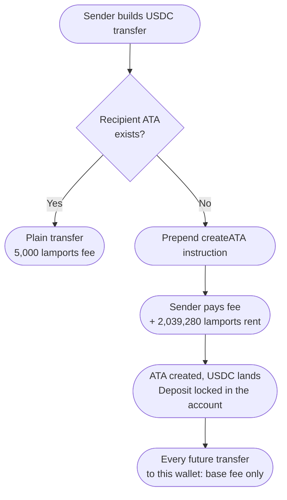

You send 100 USDC on Solana to a teammate's brand new wallet. The transfer goes through fine, but when you check your own balance afterward, you're down a bit more SOL than the usual fraction-of-a-cent fee. Not a lot. Around 0.002 SOL. Enough to notice if you're watching.

Send another 100 USDC to the same address and the extra charge is gone. Just the normal 5,000 lamport fee this time.

That one-time charge wasn't a fee at all. You paid a **rent deposit** to create a storage account on the recipient's behalf, because on Solana, holding a token isn't free. Someone has to pay for the bytes.

---

## Your wallet doesn't hold USDC

This is the part that trips people up coming from Ethereum, so let's get it out of the way.

On Ethereum, your USDC balance is an entry inside the USDC contract's own storage. One contract, one giant mapping of address to balance. Your wallet address is just a key in someone else's database.

Solana flips this. The SPL Token program doesn't keep a central ledger. Instead, every (wallet, mint) pair gets its own dedicated account on chain, a **token account**, owned by the Token program, holding exactly one balance. Your wallet is a system account holding SOL. Your USDC lives somewhere else entirely.



So when you "send USDC to a wallet," what actually happens is a transfer between two token accounts. And if the recipient has never held USDC, their token account for it **doesn't exist yet**. It has to be created before anything can land in it.

That creation is where the SOL goes.

---

## Rent: why accounts cost money

Every account on Solana occupies validator memory. All of it, all the time, because the full account state has to be available for any transaction that might touch it. That's expensive at the scale Solana runs at, so the protocol charges for it: **rent**.

The original design collected rent continuously, draining lamports from accounts each epoch. That mechanism is now deprecated. What survives is the exemption rule: an account is left alone forever if it holds a minimum balance, roughly two years' worth of rent at the protocol rate. And since rent collection was removed, that's no longer optional. **Every new account must be rent-exempt at creation.** You literally cannot make one below the threshold; the transaction fails with `insufficient funds for rent`.

The math is deterministic:

```
minimum = (data_size + 128) × lamports_per_byte_year × 2
        = (165 + 128) × 3,480 × 2
        = 2,039,280 lamports
        ≈ 0.00204 SOL
```

The 128 bytes is fixed account overhead, 165 bytes is the size of an SPL token account, 3,480 lamports per byte-year is the protocol rent rate. Every classic SPL token account costs exactly 2,039,280 lamports to open. USDC, BONK, JUP, doesn't matter. Same size, same deposit.

The important word is *deposit*. Those lamports sit inside the token account itself. They're not burned, not paid to validators. Close the account later and you get every lamport back. More on that below.


*Left bar is the base transaction fee. Right bar is fee + 2,039,280 lamport rent deposit. About a 400x difference, all of it refundable except the fee.*

---

## Associated Token Accounts: the addressing trick

A wallet could technically own several token accounts for the same mint at arbitrary addresses, which would be a mess. How would a sender know which one to pay into?

The **Associated Token Account** (ATA) convention solves this. The ATA address is a program-derived address, computed deterministically from three inputs:

```
ATA = findProgramAddress(
    [wallet_pubkey, token_program_id, mint_pubkey],
    associated_token_program_id
)
```

No lookup, no registry, no asking the recipient. Given any wallet and any mint, everyone on the network derives the same address. That's why you can send USDC to someone who has never touched USDC: the destination is knowable before it exists.

Knowable, but not existent. Deriving an address costs nothing. Allocating 165 bytes at that address costs the rent-exempt minimum, and the Associated Token Program lets **anyone** do it, permissionlessly, on behalf of any wallet.

---

## So who actually pays?

Whoever is the fee payer on the transaction that includes the create instruction. In practice:

**Wallet-to-wallet sends: the sender pays.** Phantom, Solflare and friends check whether the recipient's ATA exists. If not, they quietly prepend a `createAssociatedTokenAccountIdempotent` instruction to your transfer. You sign one transaction, and 0.00204 SOL leaves your wallet along with the USDC. Most wallets show this in the fee breakdown, but it's easy to miss.

**Exchange withdrawals: the exchange pays, sort of.** When you withdraw USDC from an exchange to a fresh wallet, the exchange's hot wallet fronts the ATA creation. They're not doing it out of kindness; the cost is baked into the withdrawal fee you're already paying. This is one reason SPL withdrawal fees are what they are despite Solana's near-zero transaction costs.

**Airdrops and mass payouts: the distributor pays, and it adds up.** Sending tokens to 100,000 fresh wallets means fronting about 204 SOL in rent deposits. This is a real line item for airdrop campaigns, and it's why some distributors use claim-based flows instead: make the recipient submit the claim transaction, and the ATA creation lands on their fee bill.

**The recipient can pre-pay.** Nothing stops you from creating your own ATA before anyone sends you anything. Then every inbound transfer, from anyone, costs the sender only the base fee.

The `Idempotent` variant of the create instruction matters here. The original instruction fails if the account already exists, which is a race condition waiting to happen when two senders target the same fresh wallet in the same slot. The idempotent version turns "already exists" into a no-op, so wallets attach it unconditionally without checking first.



---

## The deposit is recoverable

This is the redeeming part of the design. That 0.00204 SOL isn't gone, it's parked.

A token account can be closed by its owner once the token balance is zero. The close instruction sends the account's entire lamport balance, the whole rent deposit, to any destination you choose:

```
spl-token close <MINT_ADDRESS>
```

Note who gets it back: the **owner of the token account**, not whoever paid to create it. If you funded ATAs for 100,000 airdrop recipients, that SOL now belongs to them. Each recipient can empty their token balance, close the account, and pocket your 0.00204 SOL. From the protocol's perspective this is fine. Someone paid for the bytes, the bytes get freed, the deposit follows the storage.

This also enables a small but real hygiene habit: wallets accumulate dead token accounts from dust, delisted tokens, and old airdrops. Each one is 0.00204 SOL sitting idle. Tools like Sol Incinerator exist purely to sweep these. A wallet that's been through a couple of airdrop seasons can easily have 20 or 30 empty token accounts, which is a recoverable ~0.05 SOL.

---

## One more trap: the fresh wallet itself

There's a second rent threshold hiding in this scenario, and it bites in a different place.

The recipient's wallet, the plain system account, is also an account, and the same rule applies: it can't be created below its rent-exempt minimum. For a zero-data system account that's:

```
(0 + 128) × 3,480 × 2 = 890,880 lamports ≈ 0.00089 SOL
```

So if you try to send 0.0005 SOL to a brand new address, the transaction fails outright. Not the token transfer case exactly, but the same root cause, and it produces the same confused "why did this tiny transfer fail" moment. Any first transfer of SOL to a fresh address needs to clear ~0.00089 SOL or the runtime rejects it.

Interestingly, the token transfer path *doesn't* require the recipient's wallet to exist at all. The ATA derivation only needs the public key. You can send USDC to an address that has zero SOL and zero on-chain history, and it works, because the account being created is the ATA, funded by you. The recipient ends up in the mildly absurd state of holding $100 of USDC with no SOL to pay the fee to move it. Every Solana support channel has seen this one.

---

## Token-2022 changes the numbers

Everything above assumes classic SPL token accounts at a fixed 165 bytes. The newer Token-2022 program supports extensions (transfer fees, confidential transfers, memo requirements, interest accrual), and each extension the *mint* enables adds bytes to every token account for it.

A Token-2022 account with a couple of extensions might be 200 to 300+ bytes, and the rent deposit scales linearly with size. Still fractions of a cent to a few cents at current prices, but the "every token account costs exactly 2,039,280 lamports" rule only holds for the classic program. If you're building payout infrastructure, compute the minimum per mint instead of hardcoding it. `getMinimumBalanceForRentExemption` exists for a reason.

---

## Quick reference

**Sending tokens to a possibly-fresh wallet:**
- Expect the first transfer per (wallet, mint) pair to cost ~0.00204 SOL extra
- Use `createAssociatedTokenAccountIdempotent`, not the non-idempotent version
- The deposit is the recipient's to reclaim, not yours. Price accordingly for bulk sends.

**Receiving tokens on a new wallet:**
- You don't need SOL to *receive*, but you need SOL to do anything after. Fund the wallet with at least ~0.01 SOL.
- A tiny inbound SOL transfer (under 890,880 lamports) to your fresh address will fail. It's not the sender's wallet being broken.

**Cleaning up:**
- Zero-balance token accounts each return 0.00204 SOL when closed
- `spl-token close <mint>` per account, or a sweeper tool for many at once

---

## The bigger picture

Ethereum and Solana are answering the same question, "who pays for token balance storage," in opposite ways. Ethereum charges the *first writer* through gas: initializing a fresh storage slot in the ERC-20 mapping costs 20,000 gas extra, paid once by the sender and never refunded in current gas rules. That cost is invisible because it's blended into a fee people already expect to fluctuate.

Solana makes the same cost explicit, refundable, and pinned to a visible account you can point at in an explorer. That's arguably the more honest design. Storage has a price, the price is a deposit, and freeing the storage returns the deposit. But explicit costs generate support tickets in a way that blended costs don't, which is why "why did my USDC transfer cost 0.002 SOL" is a perennial question and nobody ever asks why their first-ever ERC-20 transfer to a new holder cost more gas than the second.

---

> If you're building anything that sends SPL tokens programmatically, always use the idempotent create instruction and always fetch the rent minimum at runtime. The two most common payout bugs on Solana are racing a create instruction and hardcoding 2,039,280.
