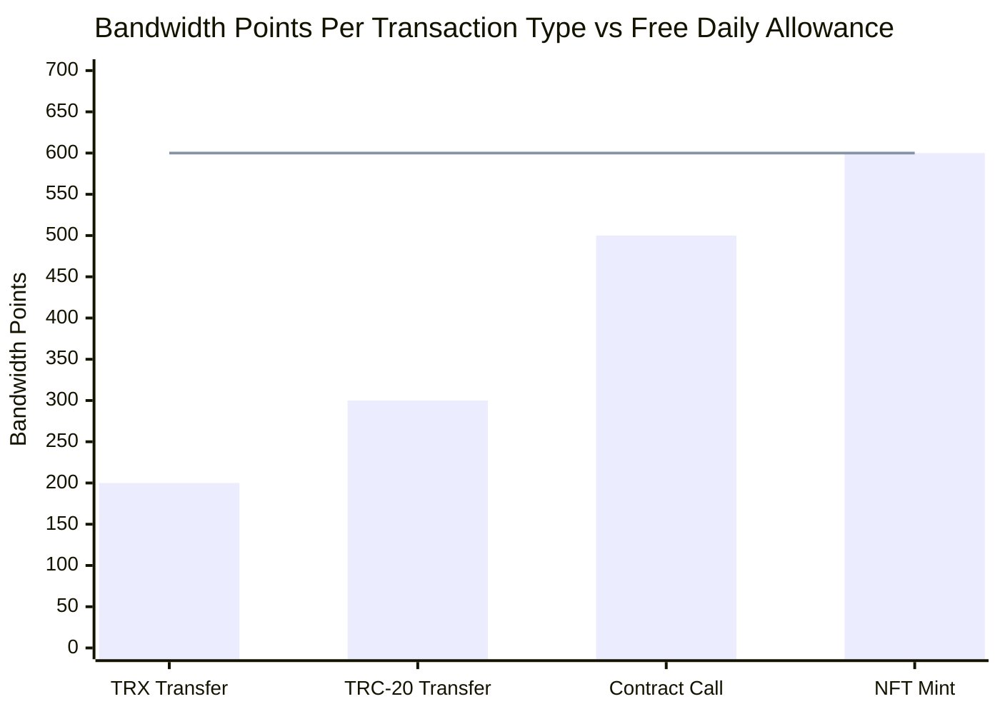
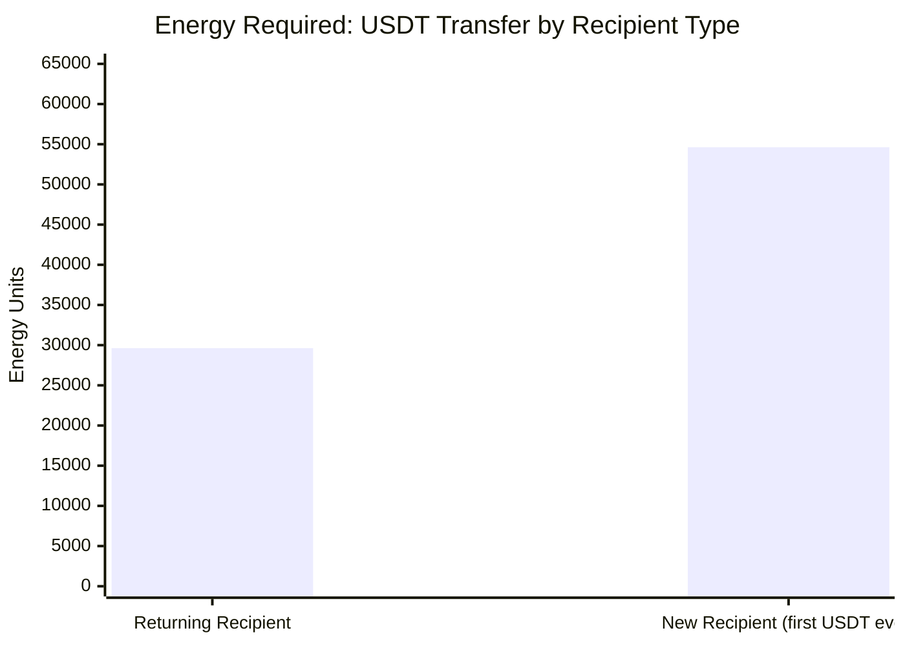
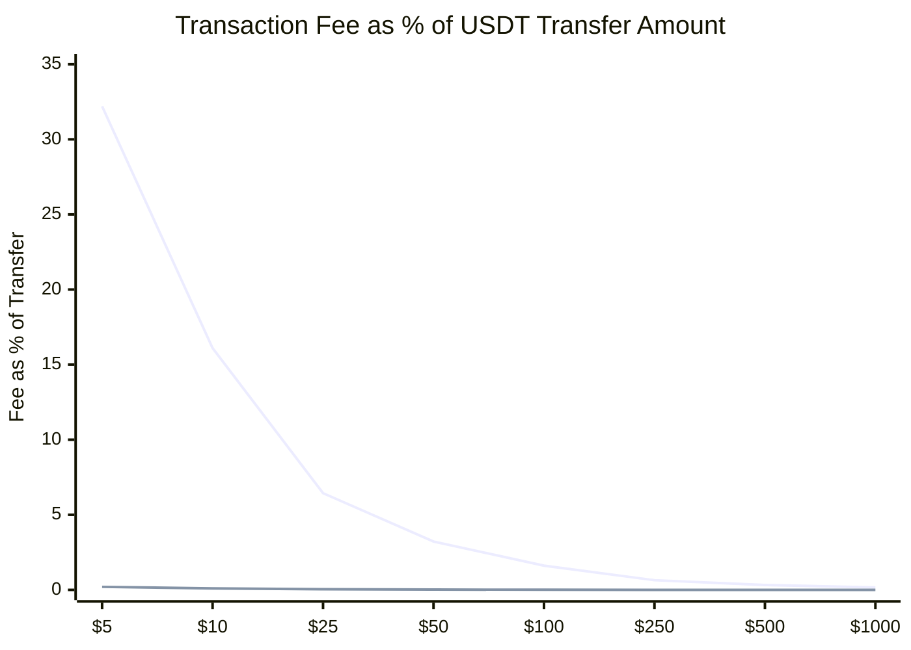
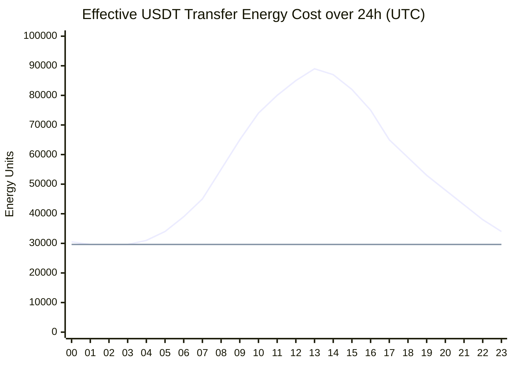
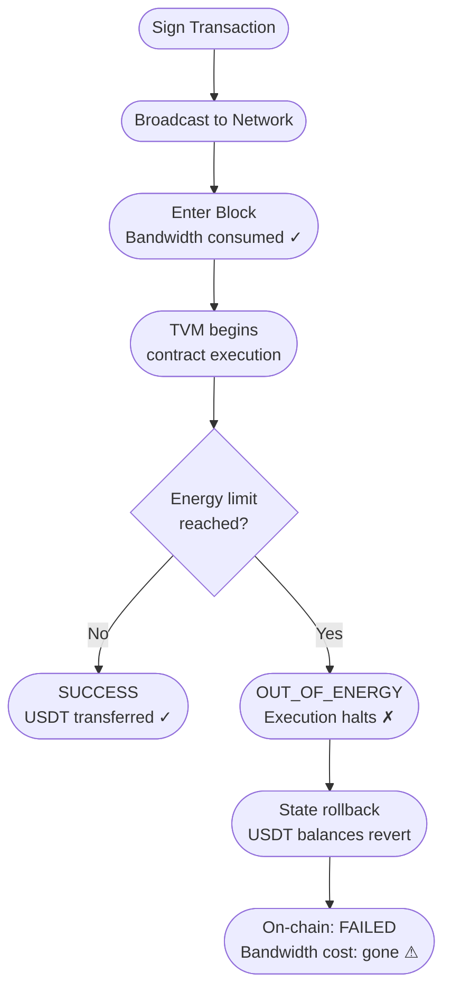
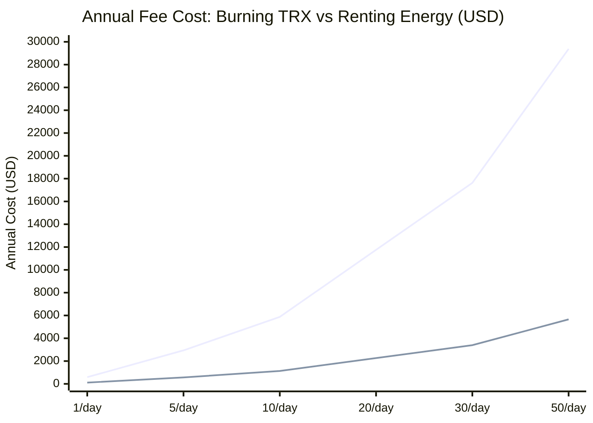

You send 500 USDT. Your wallet shows a transaction hash. Your colleague checks their wallet... nothing there. You paste the hash into TronScan. It's confirmed, it's in a block, everything looks fine. But for some reason, The USDT just... didn't move.

No error. No refund prompt. The money didn't arrive, and there's no obvious explanation **why**.

This happens more often than it should, and it stems from something most TRON users don't think about.

TRON has *two* separate fee resources, and a transaction can satisfy one completely while running out of the other. midway through execution.

Those two resources are **bandwidth** and **energy**. While not entierly unique to the TRON network, These things lead to headaches that while ignored can cost you money for nothing.

---

## The Two resource Model

Most blockchains keep it simple: one fee, one token. Send ETH or BNB, you pay gas. Done.

TRON decided to split the cost of a transaction into two distinct things:

- **Bandwidth**: the cost of *getting* your transaction data onto the network itself. It's kind of like the shipping fee. Every transaction pays bandwidth, no matter what type.
- **Energy**: the cost of actually *executing* the smart contract code. This only applies when the transaction involves a smart contract, like when you're sending a TRC-20 token like USDT, USDC, etc.

The key thing to understand is that these are independent. Your transaction can fully pay for bandwidth and still fail if it runs out of energy. But when that happens the network isn't giving back the bandwidth cost.

---

## Bandwidth: the easy one

Bandwidth is charged on every transaction, and it's measured directly in bytes. One byte of transaction data costs one bandwidth point. A typical USDT transfer is around 265–350 bytes, so you're looking at roughly 300 bandwidth points per send.

But there's a breather, You get some bandwidth for free everyday.

| Source | Amount | How |
|---|---|---|
| Free daily allowance | 600 BP/day | Automatically, just for having an account |
| Stake 2.0 | Network-dependent | Stake TRX to receive bandwidth |
| TRX burn | On demand | Network burns your TRX if you run out (~0.001 TRX per 300 BP) |

600 free bandwidth points covers about two average TRC-20 transfers a day at zero cost. If you're an occasional user, you'll probably never think about bandwidth fees at all.


*Flat line = 600 BP free daily allowance. Two TRC-20 transfers exactly exhausts it.*

By design **you can't fail a transaction because of bandwidth**. The network won't allow it. If your free allowance runs out, TRON burns a little TRX from your wallet and carries on. The only way bandwidth stops a transaction is if you have zero bandwidth *and* zero TRX. In that case, it gets rejected before it ever hits the chain.

---

## Energy: the one that bites you

This is where things get asymmetric.

Energy is only consumed when smart contract code actually executes. Plain TRX transfers? No energy needed. But the moment you send a TRC-20 token like USDT, you're calling the token's smart contract, which requires some code to be executed on the network and that costs energy.

Here's the thing, there's no such thing as **free energy**. None. Your account starts at zero and stays there unless you do one of two things:

1. **Stake TRX** through Stake 2.0 and get an energy allocation that refreshes daily
2. **Let TRON burn TRX** from your wallet at the current energy rate

This asymmetry is the root of most TRON fee confusion, bandwidth gets a daily freebie, energy doesn't.

### So how much does a USDT transfer actually cost?

It depends on the recipient. Specifically, whether they've ever held USDT before:

- **Returning recipient** (they already have USDT): ~**29,631 energy**
- **New recipient** (first time receiving USDT): ~**54,631 energy**

That extra ~25,000 energy for a new recipient goes toward initializing their slot in the USDT contract's balance mapping database. It's a one-time storage write that only happens once per address. So for each new address on the network you would have to pay the extra ~25K energy fee.


*At 420 sun/energy: returning recipient = ~12.4 TRX, new recipient = ~22.9 TRX.*

If you're burning TRX to cover these fees (no staking), the current network rate is **420 sun per energy unit** (1 sun is 10⁻⁶ TRX):

```
29,631 energy × 420 sun = 12,444,420 sun ≈ 12.4 TRX
```

At $0.13/TRX, that's about **$1.61 per USDT transfer**. That might sound tolerable for a $500 transfer (it's 0.3%), but for a $10 transfer, that's a 16% fee. The fee is flat. It doesn't scale with the amount you're sending.


*Top line = burning TRX (~$1.61 flat fee). Bottom line ≈ 0% = energy covered by staking.*

---

## The hidden multiplier

Those energy numbers? They're actually the *floor*.

TRON introduced a dynamic energy model ([TIP-491](https://github.com/tronprotocol/tips/issues/491)) that applies a congestion multiplier to popular contracts. The more a contract gets called over a rolling time window, the higher the multiplier, up to a cap.

USDT on TRON is one of the most-called contracts on any public blockchain. During peak hours, the effective multiplier for USDT transfers routinely hits **1.5× to 3×** the base. That 29,631 energy baseline can balloon to anywhere between 45,000 and 89,000 energy depending on when you send.


*Fluctuating line = actual effective cost with dynamic multiplier. Flat line = 29,631 base. Peaks around 13:00–15:00 UTC can reach ~3× baseline.*

If you've staked enough TRX to cover the dynamically-adjusted cost, the multiplier doesn't affect you. But if your staked energy runs short and the network needs to top up by burning TRX, it burns at the adjusted energy amount, not the base.

---

## How the silent failure actually happens

When someone sends USDT, here's the sequence at the protocol level:

1. The wallet builds the transaction and sets a `feeLimit`, which caps how much energy can be spent during execution. Many wallets default this very low, sometimes as low as 10,000 energy.
2. The sender signs and broadcasts. The network receives it, bandwidth is consumed (or TRX is burned). The transaction gets included in a block. **This is irreversible.**
3. The TRON Virtual Machine (TVM) starts executing the USDT contract's `transfer()` function.
4. Partway through, the energy counter hits the `feeLimit`. The TVM stops.
5. Everything the contract did gets rolled back. USDT balances revert to where they were.
6. The transaction lands on-chain with status `FAILED` and reason `OUT_OF_ENERGY`.


*Bandwidth gets spent the moment a transaction enters a block, regardless of what happens next.*

Your USDT didn't move. The bandwidth you paid is gone. And you're holding a transaction hash that *looks* like it worked.

### Why doesn't your wallet warn you about this?

Three reasons, and they compound each other:

**Wallets confirm the broadcast, not the execution.** When a wallet returns a transaction hash and says "sent," it's confirming that the network accepted the broadcast, not that the contract ran successfully. Those happen at different times, and most wallets don't follow up to check the execution result.

**The failure is on-chain, but you have to look for it.** If you paste the hash into TronScan and look at the detail page, you'll see `Result: FAILED` and `Energy Usage: OUT_OF_ENERGY` clearly. But most people forward the hash to the recipient, assume it's done, and move on.

**There's nothing obviously wrong with your balance.** On Ethereum, a failed transaction still costs you gas. Your ETH balance goes down, which signals that something happened. On TRON, if the bandwidth fee was covered by the free daily allowance, your TRX balance doesn't change at all. The only thing that moved was an internal bandwidth counter that your wallet probably doesn't show you.

---

## Staking for energy: when does it make sense?

If you're sending USDT regularly, even just a handful per day, burning TRX for every transaction adds up fast. And it's highly expensive. Staking is the alternative.

**How Stake 2.0 works for energy:**
- You freeze TRX into the network. It's locked, but not spent.
- The frozen TRX generates an energy allocation that refreshes every 24 hours.
- The ratio (energy per TRX per day) floats with total network staking volume. Roughly **1–2 energy/TRX/day** is a working estimate.
- After a 14-day lockup period, you can unstake and get your TRX back in full.

What does that look like for a business sending 10 USDT transfers per day?

```
Energy needed/day:    10 × 29,631 = 296,310
TRX to stake:         296,310 ÷ 1.5 energy/TRX ≈ 197,540 TRX
Capital locked:       ~$25,680 at $0.13/TRX
```

Versus just burning TRX instead:

```
TRX burned/day:       10 × 12.4 TRX = 124 TRX
Annual burn cost:     124 × 365 × $0.13 ≈ $5,884/year
```

Staking turns an annual operating expense into a capital commitment you can recover when you're done. The real cost is just the opportunity cost on the locked TRX: what else could that capital be doing?

---

## Renting energy: a middle path

You don't have to stake your own TRX. Stake 2.0 allows **energy delegation**. Any account with staked energy can lend that allocation to another address for a time window, without moving the underlying TRX.

A whole rental market has built up around this. Platforms let you rent delegated energy per transaction:

- **Rental rate:** Roughly **40–80 sun per energy** (vs. 420 sun to burn it yourself)
- **Renting 30,000 energy at 80 sun:** 2,400,000 sun = **2.4 TRX** (~$0.31)
- **Burning 30,000 energy:** 12,600,000 sun = **12.6 TRX** (~$1.64)

Renting costs about **81% less** than burning. The catch: the rental platform needs to deliver the delegation *before* your transaction is broadcast. That's a timing dependency that self-staking doesn't have.


*Top line = burning TRX. Bottom line = renting energy. The 81% gap holds at every volume.*

---

## Quick reference

**Before you send USDT:**
1. Check your energy balance, not just your TRX balance. Most wallets show this in the resource panel.
2. Keep at least ~15 TRX available if your energy is at zero (that covers a base-cost transfer with some buffer)
3. Set your `feeLimit` to at least 65,000. That covers the base cost, the dynamic multiplier at peak, and new-account overhead.
4. After sending, check `Contract Result: SUCCESS` on TronScan, not just the hash.

**If you send regularly:**
- Past about 3 transfers/day, renting or staking energy beats burning TRX within weeks
- Keep ~500 TRX as a bandwidth reserve even when you're staking for energy

**If a transfer silently failed:**
- Your USDT is still in your wallet. The state rollback means nothing moved.
- The bandwidth cost is gone, but it's tiny (≤0.001 TRX, possibly zero if it was within the free allowance)
- Retry the transfer and bump the `feeLimit` first. TronLink lets you edit this directly in the confirmation dialog.

---

## The bigger picture

The two-resource design is actually interesting from a protocol standpoint. By decoupling data propagation cost (bandwidth) from computation cost (energy), TRON gets independent dials for each. Heavy smart contract usage doesn't have to price out simple TRX transfers, and vice versa.

The downside is exactly what we've been describing: a transaction can clear the submission layer and fail at the execution layer, and those two outcomes aren't atomically linked. Ethereum has the same class of failure (out-of-gas reverts), but years of wallet tooling have made that failure hard to miss. TRON's wallets haven't caught up yet.

The silent failure isn't a protocol flaw. It's documented, the failure reason is right there on-chain, and fixing it is straightforward once you know what to look for. The gap is just in how wallets surface it to users.

---

> Always verify USDT transfers by checking `Contract Result` on [TronScan](https://tronscan.org). A transaction hash tells you the transaction was submitted. It says nothing about whether the contract actually ran.
