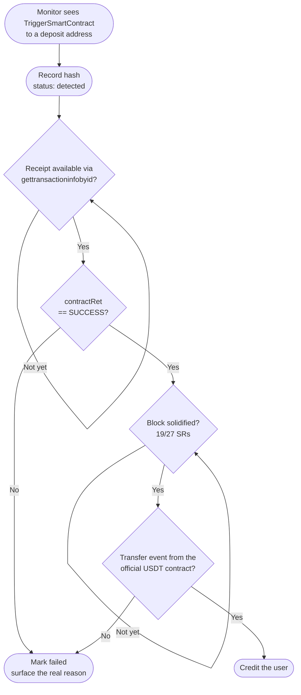

Your deposit monitor fires. A USDT transfer just hit one of your TRON deposit addresses, the hash resolves on TronScan, the block is confirmed, and the `to` address is yours. You credit the user. An hour later a support ticket lands asking where the money is. You pull the transaction again and everything looks right, except one field nobody checked. `contractRet: OUT_OF_ENERGY`. The USDT never moved.

I was building the same crypto payment handler I've written about before, and TRON deposits forced a decision that felt overly paranoid at the time: never credit on transaction inclusion, only on a successful execution receipt. We made that the rule, and it caught real failures within the first month. This post is the reasoning.

---

## A mined transaction and a successful transfer are different events

On TRON, "in a block" means the network accepted your transaction, charged bandwidth for the bytes, and ran whatever it contained. That run is allowed to fail, and the failure is recorded permanently in the same block, right next to the successful transactions.

The reason this surprises people is that it doesn't apply to everything on the chain equally. A native TRX transfer is a protocol-level operation. If it's included, it happened; there's no code to run, so there's nothing to fail. But a USDT transfer is a `TriggerSmartContract` call to the token contract at `TR7NHqjeKQxGTCi8q8ZY4pL8otSzgjLj6t`, asking the TVM to execute its `transfer()` function. That execution can revert, run out of energy, or hit any of the failure modes the VM defines, and the transaction gets mined anyway.

So a confirmed block tells you the network processed an attempt. Whether the attempt worked is a second question, stored in a different field, that nothing in the word "confirmed" answers.

---

## The two ways it fails

**OUT_OF_ENERGY** is the one that burns you, literally. The TVM halts mid-execution, all state changes roll back, and the network keeps the entire energy allowance the sender authorized through `fee_limit`. We covered the mechanics of this in [Why your TRON USDT transfer silently failed](/blog/tron-energy-vs-bandwidth), but the part that matters here is the asymmetry:

```
fee_limit set to:     30 TRX (a common wallet default for USDT sends)
OUT_OF_ENERGY:        burns all 30 TRX          ≈ $3.90 gone
REVERT mid-execution: burns only what ran       ≈ 1-2 TRX typically
```

**REVERT** is quieter. The contract's own logic rejected the call. The USDT contract maintains a blacklist and transfers to flagged addresses revert. So does a payout from a hot wallet whose USDT balance dipped below the amount between signing and execution. The transaction still lands on-chain, still gets confirmations, still shows up in every block explorer's list of "transactions to this address."

Both failure modes leave behind the exact artifact a naive deposit monitor treats as proof of payment. A mined, confirmed, permanent transaction that did nothing.

---

## Where the truth actually lives

TRON's API splits the answer across endpoints, and which one you ask determines what you can claim to know.

`wallet/gettransactionbyid` returns the transaction as submitted. It exists for failures too, because the transaction did happen. The transaction object carries a `ret` array, and `ret[0].contractRet` is the execution verdict: `SUCCESS`, `REVERT`, `OUT_OF_ENERGY`, and friends.

`wallet/gettransactioninfobyid` returns the receipt. This is where the fee actually burned, the execution result, and the `log` array live. The logs are the ground truth for token movement, because the USDT contract only emits a `Transfer` event when balances actually change. No event means no movement, whatever the transaction's input data claimed it was going to do.

The `walletsolidity/*` variants of both endpoints answer only for solidified blocks, meaning blocks at least 19 of the 27 super representatives have built on top of. At ~3 second blocks that's roughly a minute behind the tip, and it's the difference between "confirmed" and "can't be dropped with a fork."



*The hash gets you to "detected". Three separate checks stand between that and "credited".*

---

## Why not just count confirmations?

Confirmation counting is the standard mental model, and it deserves its reputation. It comes from Bitcoin, where it works because inclusion is the whole story. On TRON, 19-of-27 solidification is a real guarantee, and for native TRX deposits we used exactly that and slept fine. A TRX transfer cannot fail after inclusion, so hardening inclusion hardens the only thing that can go wrong.

The trap is applying that model to TRC-20. For a contract call, the thing that can go wrong isn't the block being rolled back. It's the execution inside a perfectly valid, perfectly confirmed block failing. Confirmations pile up on top of a reverted call just as faithfully as on a successful one. Block depth answers a question the failure mode wasn't asking.

The principle we ended up with: **inclusion is not execution.** Any crediting rule that conflates them will eventually pay out on a transfer that never happened.

---

## What this looked like in practice

**Poll the receipt, not the hash.** A transaction hash is a pending state, not a result. We wait for `gettransactioninfobyid` to return, then require `contractRet == SUCCESS` before anything downstream fires. Users see "deposit detected" off the hash, which keeps the UI snappy, but the balance mutation waits for the verdict.

**Credit on the Transfer event.** We parse the receipt's `log` array and require a `Transfer` event emitted by the official USDT contract address, with `to` matching the deposit address. That last check earns its keep. TRON is full of lookalike tokens that emit `Transfer` events from their own contracts, and an event from the wrong contract address is worth exactly nothing.

**Treat feeLimit as money at risk, not a ceiling.** Because OUT_OF_ENERGY burns the whole allowance, the `fee_limit` on our payout path is sized to cover roughly 65,000 energy, about 27.3 TRX or $3.55 at $0.13/TRX, and we budget that amount as the real cost of a failed send. A cap you can fully lose isn't a cap, it's an exposure.

**Ask the solidity node.** Crediting reads go through `walletsolidity/gettransactioninfobyid`, so a transaction that only ever lived on a dropped fork can't trigger a credit. The cost is about a minute of delay, which users tolerate fine when the UI already told them the deposit was detected.

---

## Quick reference

**What `contractRet` tells you:**
- `SUCCESS`: execution completed, events emitted, safe to proceed
- `REVERT`: the contract rejected the call (blacklist, insufficient token balance), partial energy burned
- `OUT_OF_ENERGY`: the TVM halted mid-run, the entire `fee_limit` is gone

**Which endpoint answers what:**
- `gettransactionbyid`: the transaction as submitted, with `ret[0].contractRet`. Exists even for failures.
- `gettransactioninfobyid`: the receipt. Fee burned, execution result, and the `Transfer` events.
- `walletsolidity/*`: the same answers, but only for solidified blocks (19/27 SRs, ~1 minute).

**Rules that served us well:**
- Hash means detected. `SUCCESS` plus a verified `Transfer` event means credited. Nothing else does.
- Check the emitting contract address on every event. Fake USDT tokens are common on TRON.
- Budget payout failures at the full `fee_limit`, ~$3.90 at a 30 TRX cap.

---

The habit of trusting confirmations comes from Bitcoin, where inclusion genuinely is the whole story because there's no execution to speak of. Every chain with a VM breaks that assumption. A block on TRON, Ethereum, or anywhere else is a container of attempts, and "confirmed" has only ever described the container. The useful question for any crediting rule isn't how deep the block is. It's whether the state change you care about actually happened, and on smart contract chains those are two different lookups.

> A transaction hash proves the network accepted the attempt. Only the execution receipt proves something happened.
